# 🚀 AI-Powered Sentiment Analysis & Customer Feedback Analytics Platform

An enterprise-style Sentiment Analysis Platform built using Flask, TextBlob, DistilBERT, SQLite, Bootstrap, and ReportLab.

The application analyzes customer reviews, performs sentiment classification using both traditional NLP and Transformer-based AI models, generates visual analytics, tracks historical reports, and exports detailed CSV/PDF reports.

---

# 🌟 Features

### 🔹 Single Text Sentiment Analysis

* Real-time sentiment analysis
* TextBlob sentiment classification
* DistilBERT sentiment classification
* Polarity score
* Subjectivity score
* Sentence-level analysis
* Keyword extraction

### 🔹 Batch CSV Analysis

* Upload customer reviews via CSV
* Analyze hundreds of reviews at once
* Processing time metrics
* Sentiment distribution analytics
* AI comparison dashboard
* Positive keyword analytics
* Negative keyword analytics
* Word cloud generation

### 🔹 Analytics Dashboard

* Total analyses performed
* Positive reviews
* Negative reviews
* Neutral reviews
* Historical sentiment records
* Trend visualization

### 🔹 Report Generation

* CSV Export
* PDF Export
* Historical Batch Reports

### 🔹 REST API

* JSON sentiment analysis API
* Live sentiment endpoint
* API testing page
* API documentation page

---

# 🛠 Tech Stack

## Backend

* Python
* Flask
* SQLite
* SQLAlchemy

## Artificial Intelligence

* TextBlob
* Hugging Face Transformers
* DistilBERT

## Data Processing

* Pandas
* CSV

## Visualization

* Chart.js
* WordCloud
* Matplotlib

## Frontend

* HTML5
* CSS3
* Bootstrap 5
* JavaScript

## Reporting

* ReportLab

---

# 📸 Application Screenshots

## Home Page

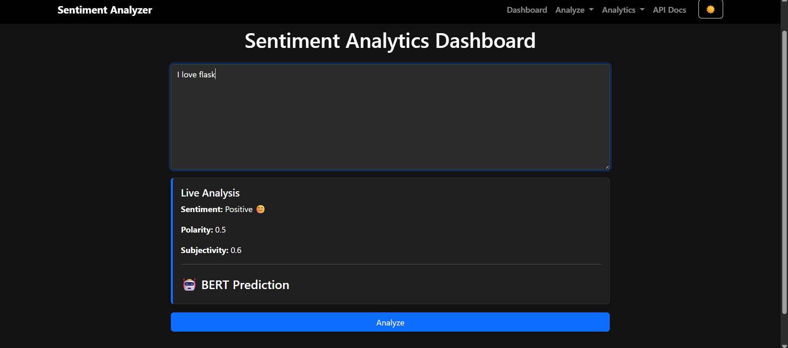

---

## Single Text Analysis

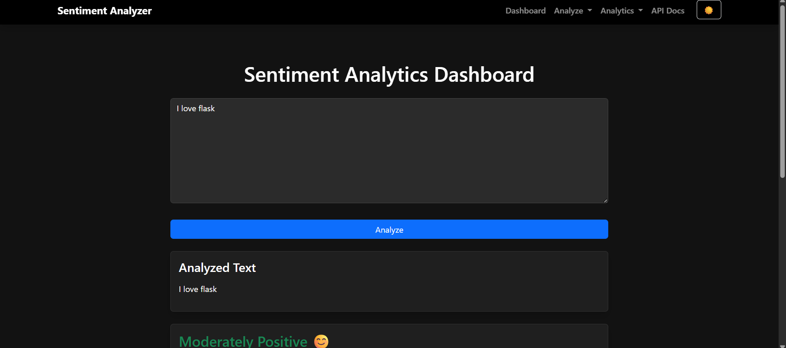

---

## Sentence-Level Analysis

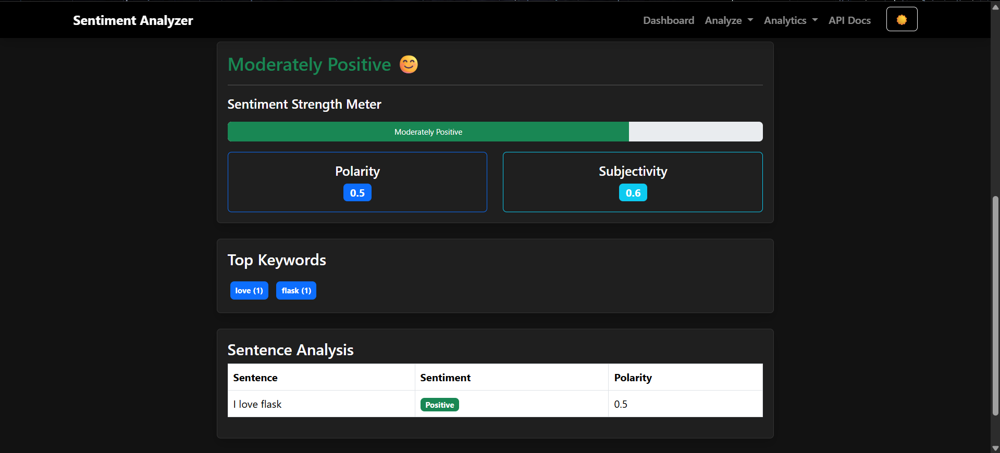

---

## Analytics Dashboard

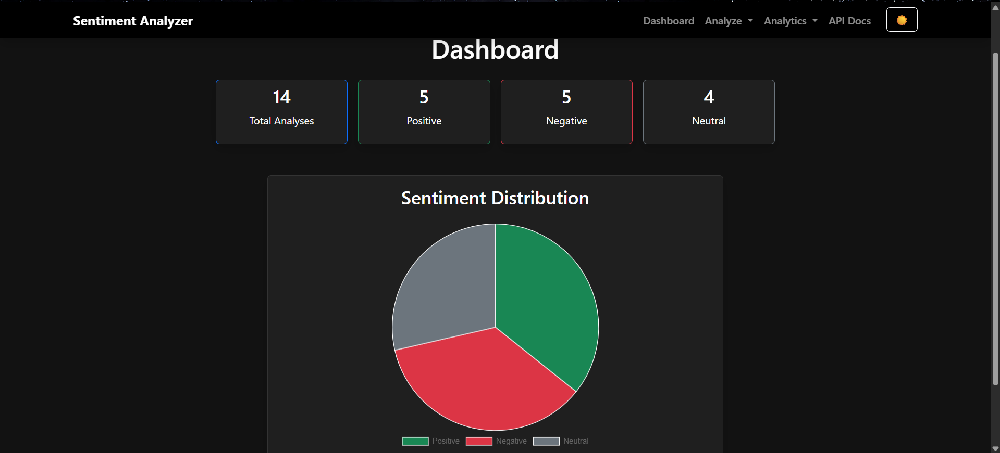

---

## Batch CSV Analysis

### Upload & Analytics

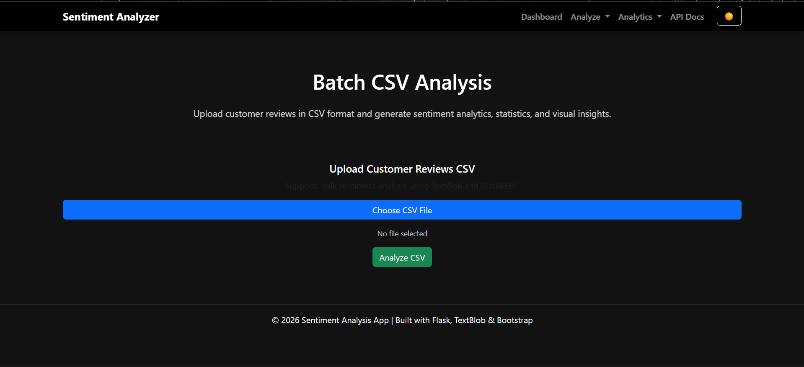

### Sentiment Distribution & Word Cloud

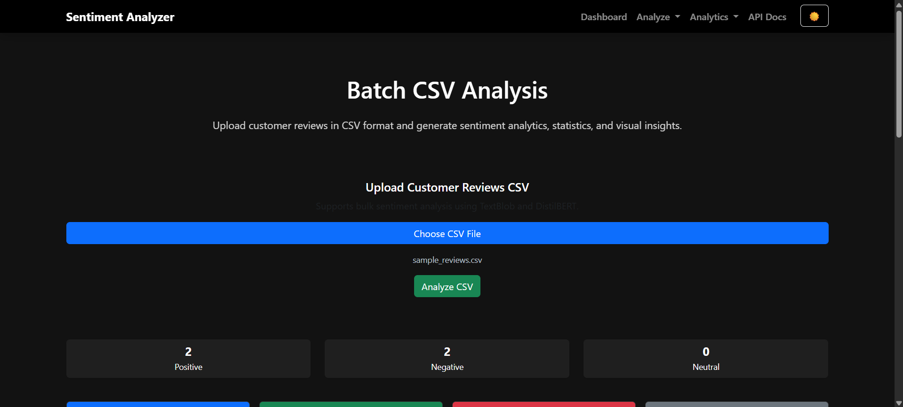

### AI Comparison Dashboard

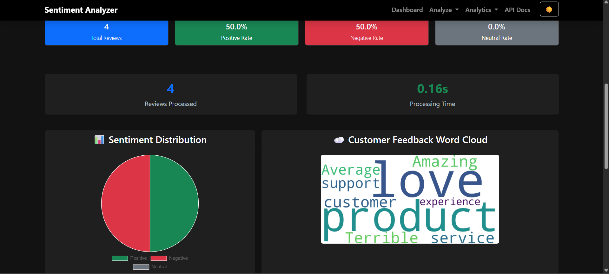

### Keywords Analytics

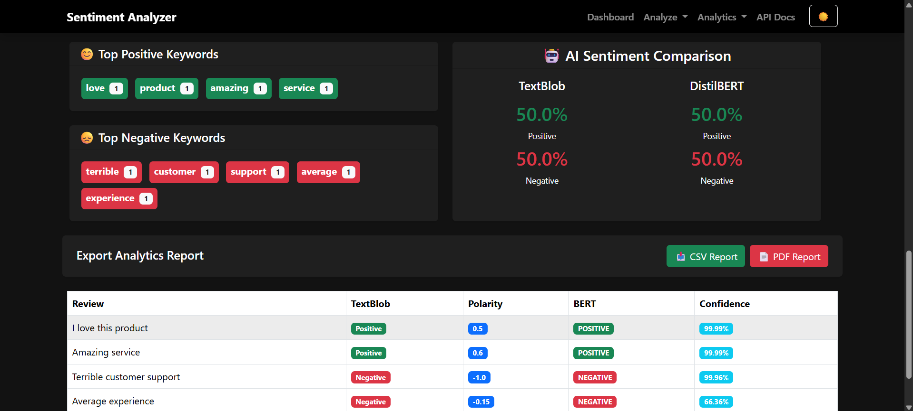

---

## Sentiment History

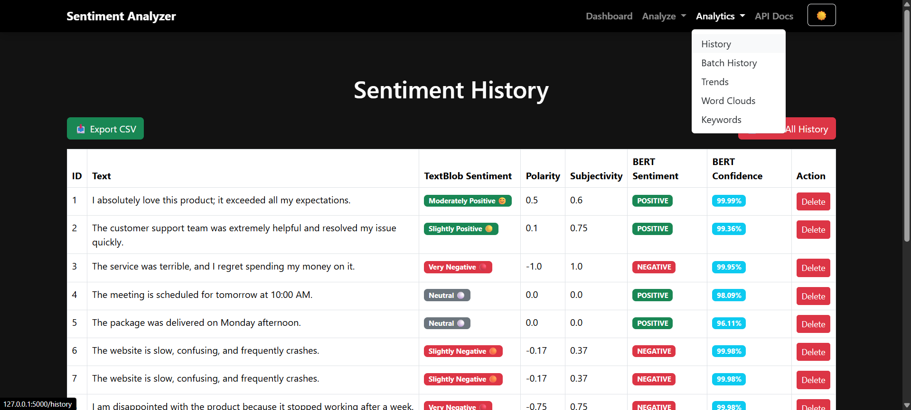

---

## Batch Analysis History

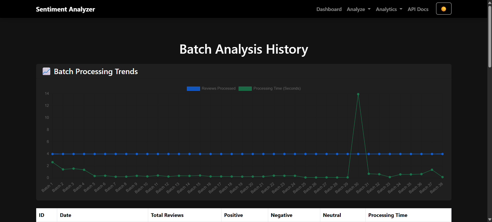

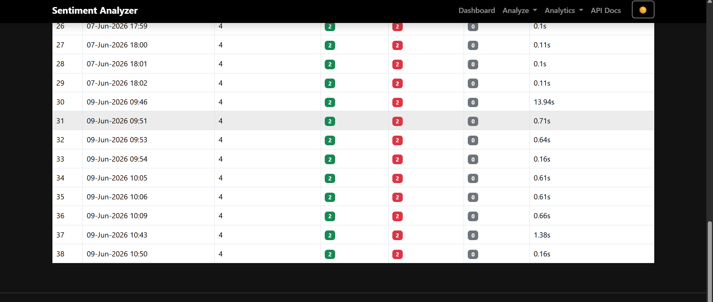

---

## Sentiment Comparison Tool

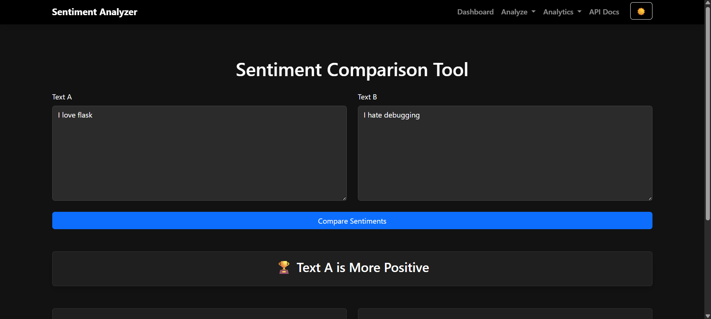

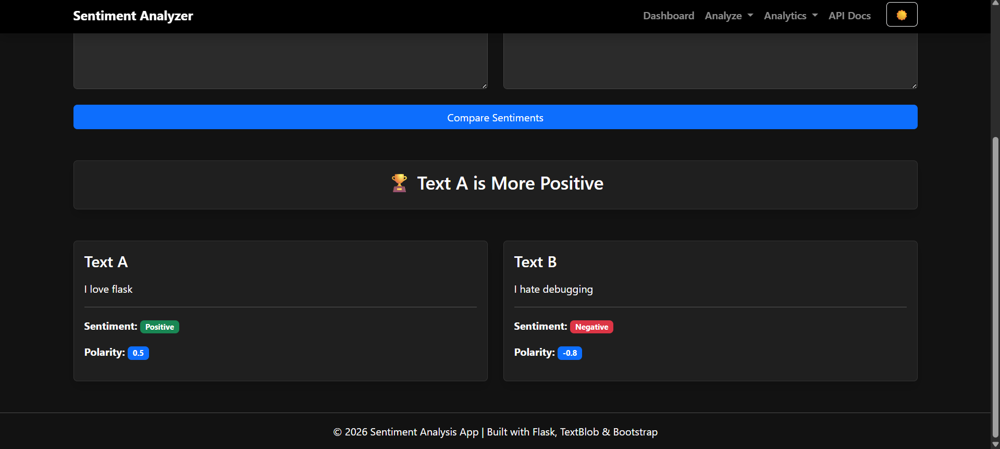

---

## Keyword Analytics

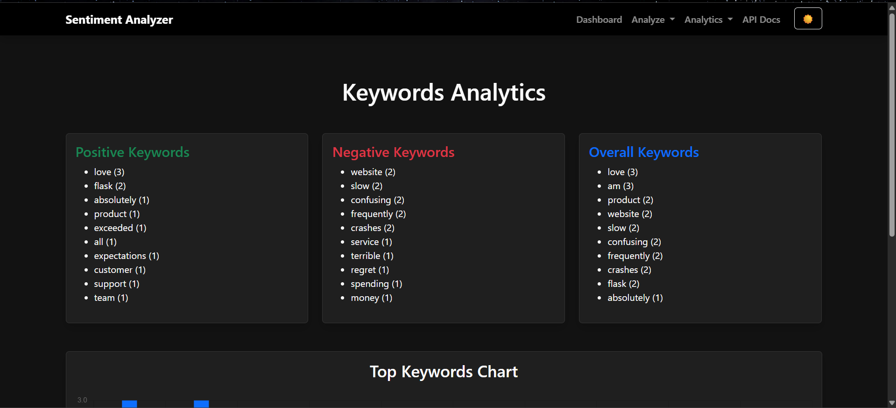

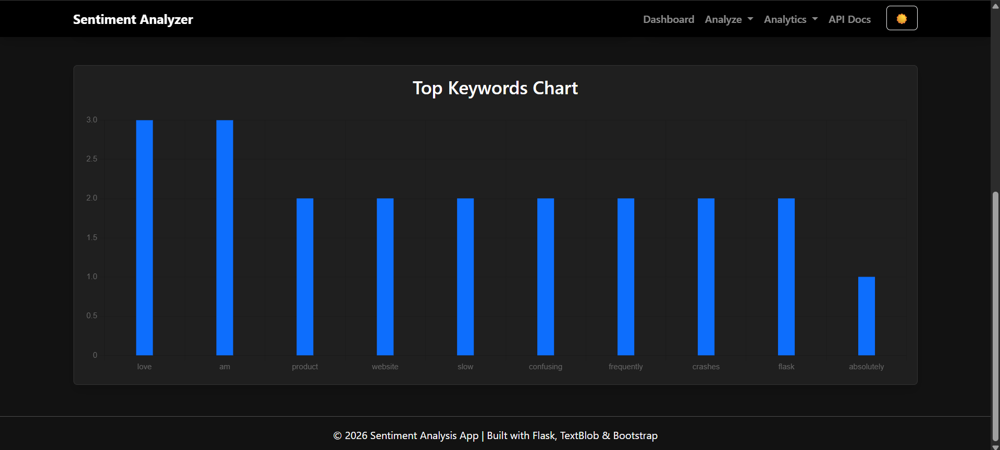

---

## Word Cloud Analytics

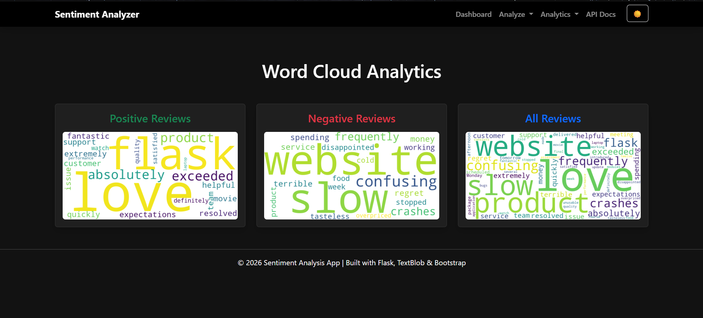

---

## Trends Dashboard

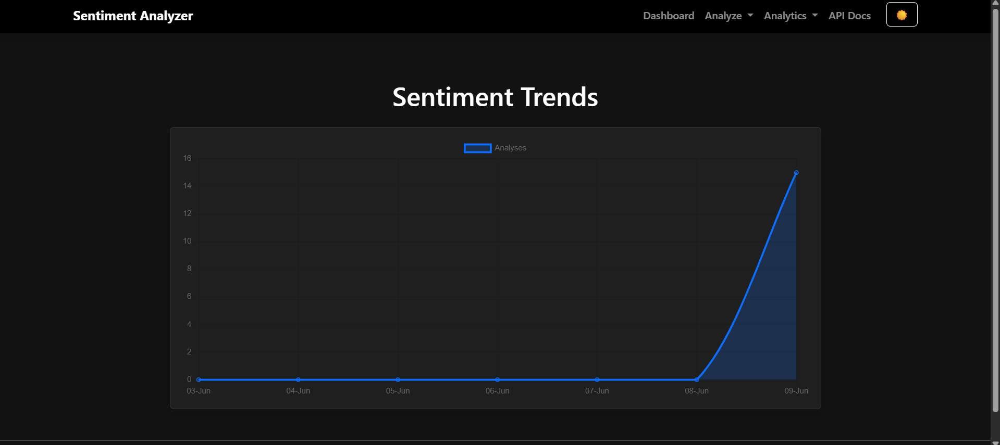

---

## API Documentation

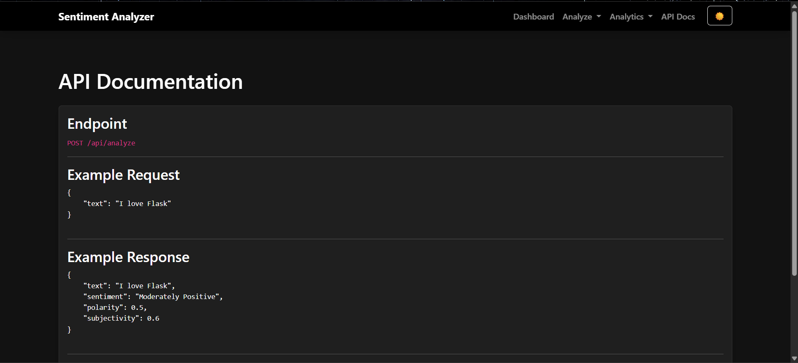

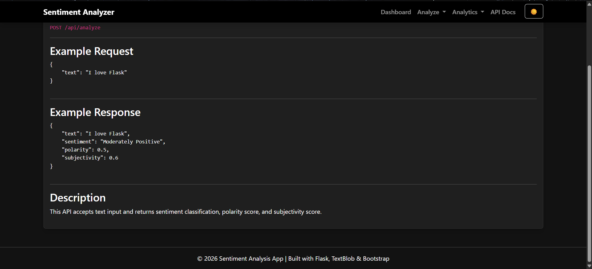

---

# 📊 System Architecture

```text
User Input / CSV Upload
        │
        ▼
Flask Application
        │
        ▼
TextBlob + DistilBERT
        │
        ▼
Sentiment Classification
        │
        ▼
Analytics Engine
        │
 ┌──────┼───────────┐
 ▼      ▼           ▼
Charts  Keywords  WordCloud
 │
 ▼
CSV / PDF Reports
```

---

# 📂 Project Structure

```text
sentiment-analysis/
│
├── app.py
├── models.py
├── requirements.txt
│
├── instance/
│   └── sentiment.db
│
├── static/
│
├── templates/
│
├── screenshots/
│   ├── home.png
│   ├── dashboard.png
│   ├── batch-analysis1.png
│   ├── batch-analysis2.png
│   └── ...
│
└── README.md
```

---

# ⚙ Installation

### Clone Repository

```bash
git clone https://github.com/vbhavitha/sentiment-analysis-platform.git

cd sentiment-analysis-platform
```

### Create Virtual Environment

```bash
python -m venv venv
```

### Activate Environment

Windows

```bash
venv\Scripts\activate
```

Linux/Mac

```bash
source venv/bin/activate
```

### Install Dependencies

```bash
pip install -r requirements.txt
```

### Run Application

```bash
python app.py
```

Open:

```text
http://127.0.0.1:5000
```

---

# 📈 Key Features Demonstrated

✅ Full Stack Development

✅ Natural Language Processing (NLP)

✅ Transformer-Based AI Models

✅ Sentiment Analysis

✅ Data Visualization

✅ REST API Development

✅ PDF Report Generation

✅ Analytics Dashboard Design

✅ Database Management

✅ Historical Report Tracking

---

# 🔮 Future Enhancements

* Multi-language Sentiment Analysis
* Aspect-Based Sentiment Analysis
* User Authentication
* Cloud Deployment (AWS)
* Docker Support
* Real-Time Streaming Analytics
* Advanced LLM Integration

---

# 👨‍💻 Author

Bhavitha Vakkalagadda

B.Tech – Computer Science Engineering (Cyber Security & Blockchain Technology)
